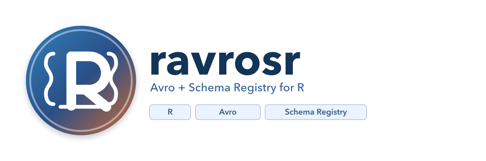

# ravrosr



Confluent Schema Registry integration and Avro serialization/deserialization for R, powered by Rust via [extendr](https://extendr.github.io/).

Works with **Confluent Schema Registry**, **Redpanda**, and any API-compatible registry.

## Installation

Requires a [Rust toolchain](https://www.rust-lang.org/tools/install) (rustc >= 1.67, cargo).

```r
# Install from source
install.packages("ravrosr", repos = NULL, type = "source")
```

## Quick Start

### Local Avro (no registry)

```r
library(ravrosr)

schema <- '{
  "type": "record",
  "name": "User",
  "fields": [
    {"name": "name", "type": "string"},
    {"name": "age",  "type": "int"},
    {"name": "score","type": "double"}
  ]
}'

data <- list(name = "Alice", age = 30L, score = 95.5)

# Serialize to Avro binary
raw_bytes <- avro_serialize_local(schema, data)

# Deserialize back to R list
result <- avro_deserialize_local(schema, raw_bytes)
result$name
#> [1] "Alice"
```

### With Schema Registry

```r
# Connect (Confluent Cloud)
client <- sr_connect(
  url        = "https://your-registry.confluent.cloud",
  api_key    = "YOUR_API_KEY",
  api_secret = "YOUR_API_SECRET"
)

# Connect (Redpanda / local, no auth)
client <- sr_connect("http://localhost:8081")

# Register a schema
schema_id <- sr_register_schema(client, "user-value", schema)

# Serialize with Confluent wire format (0x00 + schema ID + Avro)
raw <- avro_serialize(client, "user-value", data)

# Deserialize (schema is fetched from registry automatically)
result <- avro_deserialize(client, raw)
```

## API Reference

| Function | Description |
|---|---|
| `sr_connect(url, api_key, api_secret)` | Create a registry client |
| `sr_list_subjects(client)` | List all subjects |
| `sr_get_schema(client, subject, version)` | Get schema JSON (NULL = latest) |
| `sr_register_schema(client, subject, schema_json)` | Register schema, returns ID |
| `sr_check_compatibility(client, subject, schema_json)` | Check schema compatibility |
| `sr_delete_subject(client, subject)` | Delete a subject |
| `avro_serialize(client, subject, data)` | Serialize with wire format |
| `avro_deserialize(client, raw_bytes)` | Deserialize wire format |
| `avro_serialize_local(schema_json, data)` | Serialize without registry |
| `avro_deserialize_local(schema_json, raw_bytes)` | Deserialize without registry |

## Supported Avro Types

| Avro Type | R Type |
|---|---|
| null | `NULL` |
| boolean | `logical` |
| int | `integer` |
| long | `double` (R has no native i64) |
| float | `double` |
| double | `double` |
| string | `character` |
| bytes | `raw` |
| record | named `list` |
| array | `list` |
| map | named `list` |
| enum | `character` |
| union | auto-matched |
| fixed | `raw` |

## Branding

Primary logo and icon files are available in [`branding/`](branding/).

### Logo files

- [`branding/ravrosr_logo.svg`](branding/ravrosr_logo.svg) - editable vector primary logo
- [`branding/ravrosr_logo_1800x600.png`](branding/ravrosr_logo_1800x600.png) - high-res primary logo
- [`branding/ravrosr_logo_1200x400.png`](branding/ravrosr_logo_1200x400.png) - README/social size primary logo

### Icon files

- [`branding/ravrosr_icon.svg`](branding/ravrosr_icon.svg) - editable vector icon
- [`branding/ravrosr_icon_1024.png`](branding/ravrosr_icon_1024.png) - app/store icon size
- [`branding/ravrosr_icon_512.png`](branding/ravrosr_icon_512.png) - medium icon size
- [`branding/ravrosr_icon_256.png`](branding/ravrosr_icon_256.png) - small icon size

### Usage notes

- Use the full logo (`ravrosr_logo_*`) for docs, README headers, and slides.
- Use the icon (`ravrosr_icon_*`) for avatars, badges, or square placements.
- Prefer SVG for print or further editing, and PNG for quick web use.

## License

MIT
